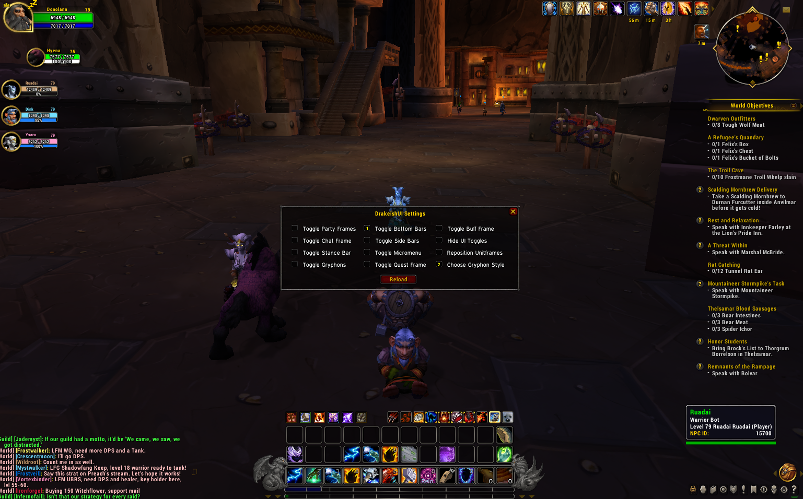

# DrakeishUI

## Description

DrakeishUI is a Dragonflight-style UI addon for World of Warcraft: Wrath of the Lich King (3.3.5). It provides a modern, clean interface that combines the best features from multiple great addons into one cohesive package.

## Features

### Core UI Components
- **Dragonflight-Style Unit Frames**: Modern player, target, and party frames with portrait support
- **Action Bars**: Customizable main action bars, sidebars, pet bar, and stance bar
- **Nameplates**: Kui Nameplates integration with customizable appearance
- **Chat System**: Enhanced chat with copy functionality
- **Minimap**: Custom minimap with border and button management
- **Castbar**: Styled casting bar for player and target
- **Buffs & Debuffs**: Custom buff/debuff display
- **Loss of Control Alerts**: Visual alerts for crowd control effects

### Additional Features
- **Bag Management**: Combuctor bag system with filtering and organization
- **Tooltips**: Enhanced item tooltips with additional information
- **Zone Information**: Cromulent integration for zone details
- **Durability Display**: Track your equipment durability
- **Experience Bar**: Custom experience bar styling
- **UI Toggles**: Collapsible UI elements for a cleaner interface
- **Grid System**: Visual grid overlay for UI alignment
- **Button Range Indicators**: Visual feedback for out-of-range abilities

## Installation

1. Download the latest release
2. Extract the `DrakeishUI` folder to your World of Warcraft `Interface\AddOns\` directory
3. The path should look like: `WoW\Interface\AddOns\DrakeishUI\`
4. Launch World of Warcraft and enable the addon in the character selection screen

## Requirements

- World of Warcraft: Wrath of the Lich King (3.3.5)
- Interface version: 30300

## Configuration

The addon saves various UI states and settings. You can customize:
- Collapsible UI elements (buffs, bags, quest tracker, chat, party frames, etc.)
- Action bar visibility and positioning
- Unit frame styles and positions
- And much more!

## Version

**Current Version:** 1.0.0

## Author

**F@bagun**

## Credits

This addon is built upon the work of many talented developers:

- **DragonflightUI**: Yuritsuki
- **Combuctor**: Tuller
- **Loss of Control Alerts**: RomanSpector & Blizzard
- **Cromulent**: phyber (Cartographer_ZoneInfo: ckknight)
- **MoP Item Tooltips**: ZEUStiger
- **Kui Nameplates**: Kesava (backported by bkader)
- **LibStub**: Kaelten, Cladhaire, ckknight, Mikk, Ammo, Nevcairiel
- **LibTourist-3.0**: ckknight, Arrowmaster (credits: Abydos)
- **LibBabble-Zone-3.0**: ckknight
- **UTF8**: Pastamancer
- **pretty_actionbar**: s0high

## License

This addon combines multiple open-source projects. Please refer to the individual module licenses for specific terms.

## Support

For issues, suggestions, or contributions, please visit the GitHub repository.

---

*Enjoy your new Dragonflight-style UI experience in Wrath of the Lich King!*

